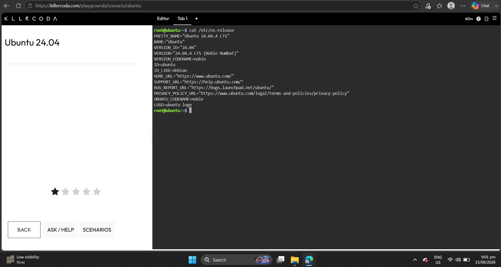
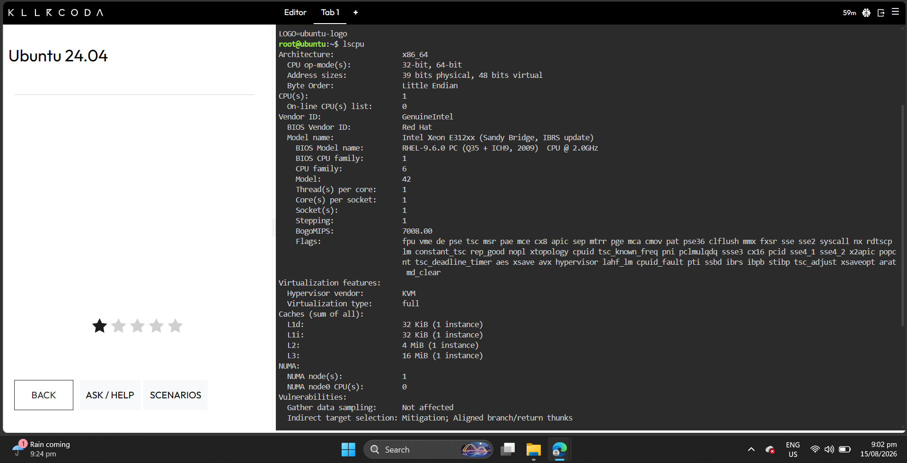
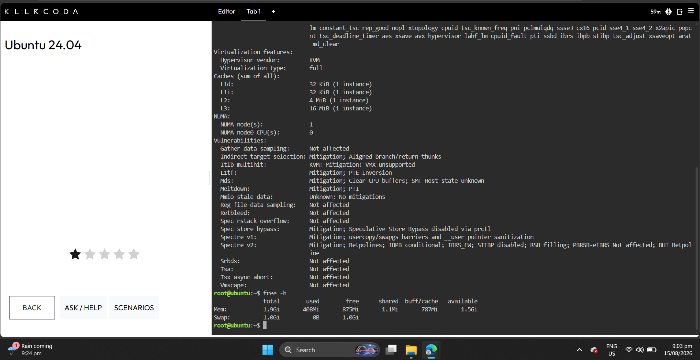
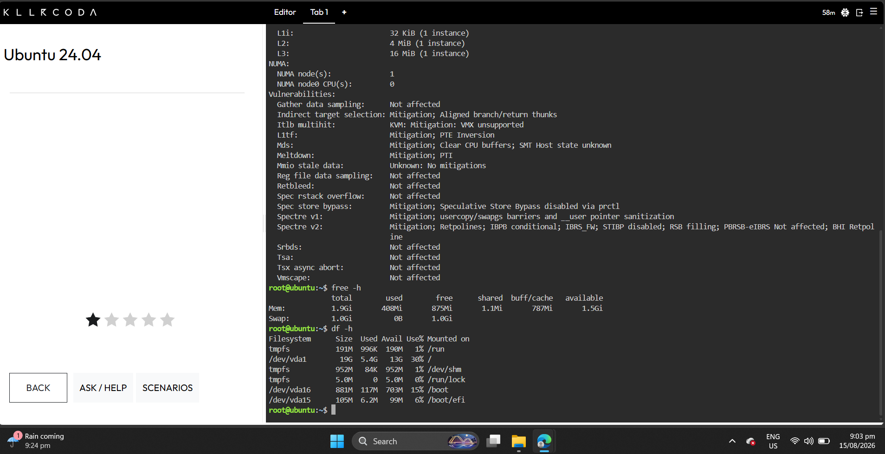

# Laboratory 03 – Multi-Cloud Explorer

## Linux Investigation

### Operating System

The KillerCoda Playground uses:

Write your actual result here.

### CPU Information

Write the important CPU information you found.

### Memory

Write the memory information from `free -h`.

### Disk Space

Write the disk information from `df -h`.

## Cloud Hosting Options

### AWS

The Linux server could be hosted using Amazon EC2.

### Azure

The Linux server could be hosted using Azure Virtual Machines.

### Google Cloud

The Linux server could be hosted using Compute Engine.

## Conclusion

Linux virtual machines can be hosted across AWS, Azure, and GCP because all three platforms rely on standard x86/ARM hardware virtualization (hypervisors) and open-source standards.

Here is why cross-cloud compatibility works seamlessly:

Standardized Hypervisors: Major cloud providers run kernel-based virtual machines (like KVM or customized hypervisors) that execute standard operating system kernels without requiring vendor-specific code modifications.

Open-Source Flexibility: Linux distributions (such as Ubuntu, Debian, Red Hat, and CentOS) are modular and freely licensed, allowing cloud providers to create optimized cloud images (cloud-init) for fast boot times and easy automated setup.

Abstracted Infrastructure: Virtual Machine instances interact with virtualized CPU, memory, storage, and networking layers. Because these abstractions follow industry standards, the underlying hardware implementation remains transparent to the Linux OS.
